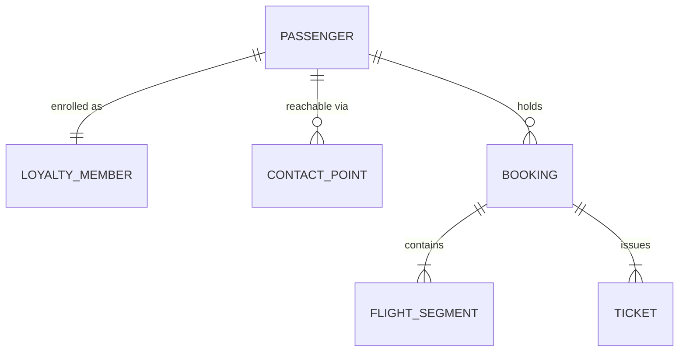

# SkyLink Airlines — Data Model & DMO Design

| | |
|---|---|
| **Project** | Agentforce passenger assistant (rebooking · loyalty · baggage · policy FAQ) |
| **Owner (agent)** | `data-cloud-eng` |
| **Status** | Draft — pending human SME validation |
| **Related ADRs** | ADR-0003 (action-type mapping), ADR-0007 (grounding boundary), ADR-0011 (identity resolution) |
| **Platform** | Salesforce Data Cloud / Data 360 |

> This is a *fictitious* example for design illustration. Field names, source systems, and
> rules are plausible but must be validated against SkyLink's real systems before build.

## 1. Purpose & scope

This document defines the **structured grounding layer** for the SkyLink agent: the Data Model
Objects (DMOs) the agent queries for facts, how source data maps into them, and how a passenger
is unified across systems. It is one of three linked grounding documents:

1. **Data Model & DMO design** *(this document)* — structured facts the agent looks up.
2. **Grounding & RAG design** — unstructured knowledge served via retrievers.
3. **Prompt template specs** — how each retriever/lookup is consumed in Prompt Builder.

## 2. Grounding source taxonomy (the load-bearing decision)

Every piece of data the agent uses falls into exactly one category. Misclassifying a source is
the most expensive mistake in the build, so it is decided here, once.

| Category | Mechanism | Examples | In this data model? |
|---|---|---|---|
| Structured fact | DMO lookup / Data Graph | loyalty tier, points, PNR, segments, tickets | **Yes — modeled below** |
| Real-time external | API action via gateway | live flight status, baggage location | **No** — fetched per request, never ingested |
| Unstructured knowledge | search index + retriever (RAG) | fare rules, baggage policy, conditions of carriage | **No** — see Grounding & RAG design |

Rationale: loyalty tier and PNR data are authoritative, queryable facts → DMO. Baggage/flight
*status* changes minute to minute, so caching it in Data Cloud would serve stale answers →
live API. Policy text is prose, not facts → retriever. The agent joins all three at runtime;
only the first is the subject of this document.

## 3. Source systems & data streams

| Source system | Role | Data stream type | Cadence |
|---|---|---|---|
| PSS — Amadeus Altéa (example) | bookings, segments, tickets | CDC / streaming | near-real-time |
| Loyalty platform | membership, tier, points | batch + event on tier change | daily + event |
| CRM (Service Cloud) | contacts, cases, consent | connector | near-real-time |
| Baggage — SITA WorldTracer (example) | bag status | **not ingested** | live API only |
| Knowledge base / CMS | policy, fare rules | file/CMS → search index | on publish |

## 4. The data model (ERD)

`PASSENGER` is the unified profile produced by identity resolution (Section 6). Everything
else hangs off it or off `BOOKING`. `FLIGHT_SEGMENT.status` and any baggage reference are
*pointers* the agent uses to call the live APIs — the live values are never stored here.

## 5. DMO data dictionary (key objects)

Maps to standard DMOs where one exists (e.g. Individual, Contact Point); otherwise custom.
PII column drives Trust Layer masking (Section 7).

### 5.1 PASSENGER  *(maps to standard Unified Individual)*
| Field | Type | Source DLO | PII | Notes |
|---|---|---|---|---|
| unifiedIndividualId | string (PK) | resolved | no | identity-resolution output key |
| firstName / lastName | string | PSS, Loyalty, CRM | yes | masked before LLM |
| dateOfBirth | date | PSS, Loyalty | yes | masked; used only for verification logic |
| nationality | string | PSS | yes | masked |
| preferredLanguage | string | CRM | no | drives agent locale |

### 5.2 LOYALTY_MEMBER  *(custom; 1:1 with PASSENGER)*
| Field | Type | Source DLO | PII | Notes |
|---|---|---|---|---|
| loyaltyId | string (PK) | Loyalty | pseudo | program number |
| unifiedIndividualId | string (FK) | resolved | no | link to passenger |
| tier | enum(Blue,Silver,Gold,Platinum) | Loyalty | no | **the loyalty-tier topic's primary fact** |
| pointsBalance | int | Loyalty | no | current redeemable balance |
| tierQualifyingMiles | int | Calculated Insight | no | aggregated, see Section 8 |
| tierExpiryDate | date | Loyalty | no | drives retention messaging |

### 5.3 BOOKING  *(maps to a standard order/reservation DMO; 1:* from PASSENGER)*
| Field | Type | Source DLO | PII | Notes |
|---|---|---|---|---|
| recordLocator | string (PK) | PSS | pseudo | the PNR |
| unifiedIndividualId | string (FK) | resolved | no | owner |
| status | enum | PSS | no | confirmed / changed / cancelled |
| bookingDate | datetime | PSS | no | |
| channel | string | PSS | no | web / app / agent |

### 5.4 FLIGHT_SEGMENT  *(custom; 1:* from BOOKING)*
| Field | Type | Source DLO | PII | Notes |
|---|---|---|---|---|
| segmentId | string (PK) | PSS | no | |
| recordLocator | string (FK) | PSS | pseudo | parent PNR |
| flightNumber | string | PSS | no | |
| origin / destination | string (IATA) | PSS | no | |
| scheduledDeparture | datetime | PSS | no | scheduled only |
| status | enum | PSS | no | **stored status is last-known; live status via API** |
| cabin | string | PSS | no | feeds rebooking eligibility |

### 5.5 CONTACT_POINT  *(maps to standard Contact Point DMOs; 1:* from PASSENGER)*
| Field | Type | Source DLO | PII | Notes |
|---|---|---|---|---|
| contactPointId | string (PK) | CRM, Loyalty | no | |
| unifiedIndividualId | string (FK) | resolved | no | |
| type | enum(email,phone) | CRM | no | |
| value | string | CRM, Loyalty | yes | masked; used for match + notify only |
| consentStatus | string | CRM | no | governs proactive contact |

## 6. Identity resolution design

Goal: one `PASSENGER` per real person across PSS, Loyalty, and CRM.

**Match rules (evaluated in order):**
1. **Exact** — same `loyaltyId` across sources → same individual (highest confidence).
2. **Exact** — normalized email + last name match → same individual.
3. **Fuzzy** — last name + date of birth + phone (last 4) → candidate match for human review,
   not auto-merged.

**Reconciliation (when sources disagree on a field):**
- Contact fields (email, phone): most-recently-updated source wins.
- Name/DOB: PSS is system of record at time of travel; Loyalty wins for profile display.
- Never merge on fuzzy alone — fuzzy produces a review queue, not a unified record.

**Output:** a `unifiedIndividualId` that all other DMOs key against. This is what lets the
agent answer "what's my tier and is my connection rebookable" from a single identity.

## 7. Governance: PII, Trust Layer, security

- **PII inventory:** name, DOB, nationality, contact value, and loyalty/PNR identifiers are
  flagged (Section 5). These are de-identified/masked by the Einstein Trust Layer before any
  prompt reaches the model, and re-identified only in the platform response path.
- **Permission scoping:** grounding runs as the authenticated portal member; field-level
  security and sharing ensure one member can never retrieve another's PASSENGER/BOOKING.
- **Guest sessions:** no PASSENGER resolution; the agent is limited to the policy-FAQ topic.
- **Retention:** raw DLOs follow source-system retention; the agent reads DMOs, not raw logs.
- **No raw PII in custom logs.** Debug/telemetry stores reference `unifiedIndividualId`, never
  name/email.

## 8. Calculated Insights & runtime retrieval (Data Graph)

- **Calculated Insights:** `tierQualifyingMiles`, segments-flown-YTD, and lifetime value are
  computed aggregations, not raw fields — defined as CIs so the agent reads a number, not a sum.
- **Data Graph for low-latency grounding:** at runtime the agent needs the passenger + tier +
  active bookings + segments in one fast read. Define a Data Graph rooted on `PASSENGER` that
  pre-joins `LOYALTY_MEMBER`, `BOOKING`, and `FLIGHT_SEGMENT` so a single retrieval returns the
  whole context — avoiding several sequential DMO queries per turn (and the token/latency cost
  that comes with them).

## 9. Refresh & latency requirements

| Data | Freshness needed | Mechanism |
|---|---|---|
| Loyalty tier / points | within a day; immediate on tier change | daily batch + event stream |
| Bookings / segments (booked state) | minutes | CDC streaming from PSS |
| Live flight status | seconds | **API action, not this model** |
| Baggage location | seconds | **API action, not this model** |
| Policy / fare rules | on publish | search index refresh (RAG doc) |

## 10. Topic → data consumption mapping

| Agent topic | Reads from this model | Plus (outside this model) |
|---|---|---|
| Loyalty tier | LOYALTY_MEMBER (tier, points, CIs) via Data Graph | — |
| Rebooking | PASSENGER, BOOKING, FLIGHT_SEGMENT, TICKET (context + eligibility) | **write** via PSS gateway action; live status via API |
| Baggage status | BOOKING (to resolve the PNR/bag link) | **live** baggage status via API |
| Policy FAQ | — | retriever (Grounding & RAG design) |

## 11. Open questions & assumptions

- Confirm whether Loyalty exposes a real-time tier-change event or only nightly batch
  (affects whether "I just hit Gold" is answerable same-day).
- Confirm the bag-tag ↔ PNR association source (PSS vs DCS) for the baggage topic's live lookup.
- Validate the fuzzy match threshold with the data-governance team before enabling the review queue.
- Confirm standard vs custom DMO for LOYALTY_MEMBER against the current Data Cloud package.
