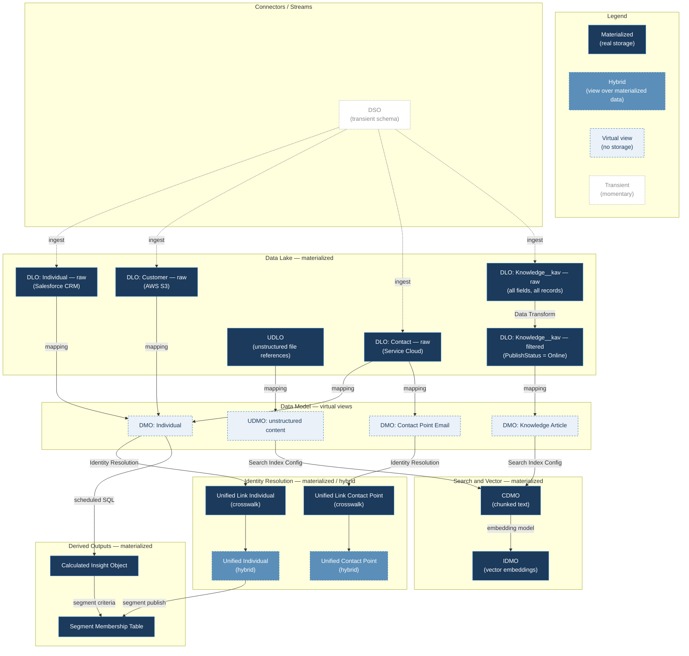

```mermaid
flowchart TB

  subgraph LEGEND[" Legend "]
    direction LR
    L1["Materialized<br/>(real storage)"]
    L2["Hybrid<br/>(view over materialized data)"]
    L3["Virtual view<br/>(no storage)"]
    L4["Transient<br/>(momentary)"]
  end

  subgraph SOURCES["Connectors / Streams"]
    DSO["DSO<br/>(transient schema)"]
  end

  subgraph LAKE["Data Lake — materialized"]
    DLO_CRM["DLO: Individual — raw<br/>(Salesforce CRM)"]
    DLO_S3["DLO: Customer — raw<br/>(AWS S3)"]
    DLO_SVC["DLO: Contact — raw<br/>(Service Cloud)"]
    DLO_KAV["DLO: Knowledge__kav — raw<br/>(all fields, all records)"]
    DLO_KAV_F["DLO: Knowledge__kav — filtered<br/>(PublishStatus = Online)"]
    UDLO["UDLO<br/>(unstructured file references)"]
  end

  subgraph MODEL["Data Model — virtual views"]
    DMO_IND["DMO: Individual"]
    DMO_CP["DMO: Contact Point Email"]
    DMO_KAV["DMO: Knowledge Article"]
    UDMO_X["UDMO: unstructured content"]
  end

  subgraph VECTOR["Search and Vector — materialized"]
    CDMO["CDMO<br/>(chunked text)"]
    IDMO["IDMO<br/>(vector embeddings)"]
  end

  subgraph IR["Identity Resolution — materialized / hybrid"]
    LINK_IND["Unified Link Individual<br/>(crosswalk)"]
    UNIFIED_IND["Unified Individual<br/>(hybrid)"]
    LINK_CP["Unified Link Contact Point<br/>(crosswalk)"]
    UNIFIED_CP["Unified Contact Point<br/>(hybrid)"]
  end

  subgraph DERIVED["Derived Outputs — materialized"]
    CIO["Calculated Insight Object"]
    SEG["Segment Membership Table"]
  end

  DSO -. ingest .-> DLO_CRM
  DSO -. ingest .-> DLO_S3
  DSO -. ingest .-> DLO_SVC
  DSO -. ingest .-> DLO_KAV

  DLO_CRM -->|mapping| DMO_IND
  DLO_S3 -->|mapping| DMO_IND
  DLO_SVC -->|mapping| DMO_IND
  DLO_SVC -->|mapping| DMO_CP

  DLO_KAV -->|Data Transform| DLO_KAV_F
  DLO_KAV_F -->|mapping| DMO_KAV

  UDLO -->|mapping| UDMO_X

  DMO_KAV -->|Search Index Config| CDMO
  UDMO_X -->|Search Index Config| CDMO
  CDMO -->|embedding model| IDMO

  DMO_IND -->|Identity Resolution| LINK_IND --> UNIFIED_IND
  DMO_CP -->|Identity Resolution| LINK_CP --> UNIFIED_CP

  DMO_IND -->|scheduled SQL| CIO
  UNIFIED_IND -->|segment publish| SEG
  CIO -->|segment criteria| SEG

  classDef materialized fill:#1B3A5C,color:#ffffff,stroke:#2E75B6,stroke-width:1px
  classDef hybrid fill:#5B8FB9,color:#ffffff,stroke:#2E75B6,stroke-width:1px,stroke-dasharray: 4 3
  classDef virtual fill:#EAF1F8,color:#1B3A5C,stroke:#2E75B6,stroke-width:1px,stroke-dasharray: 4 3
  classDef transient fill:#ffffff,color:#888888,stroke:#999999,stroke-width:1px,stroke-dasharray: 2 2

  class DLO_CRM,DLO_S3,DLO_SVC,DLO_KAV,DLO_KAV_F,UDLO,CDMO,IDMO,LINK_IND,LINK_CP,CIO,SEG materialized
  class UNIFIED_IND,UNIFIED_CP hybrid
  class DMO_IND,DMO_CP,DMO_KAV,UDMO_X virtual
  class DSO transient
  class L1 materialized
  class L2 hybrid
  class L3 virtual
  class L4 transient
```
