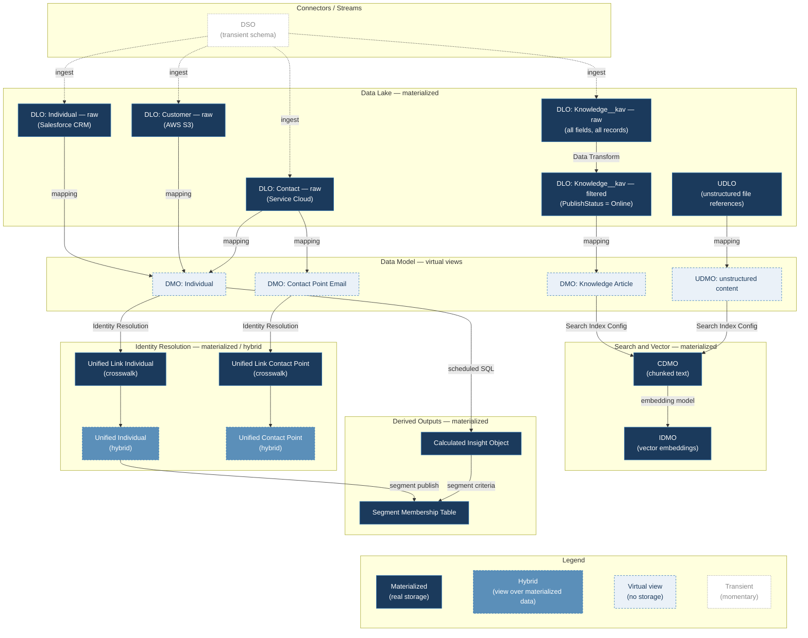
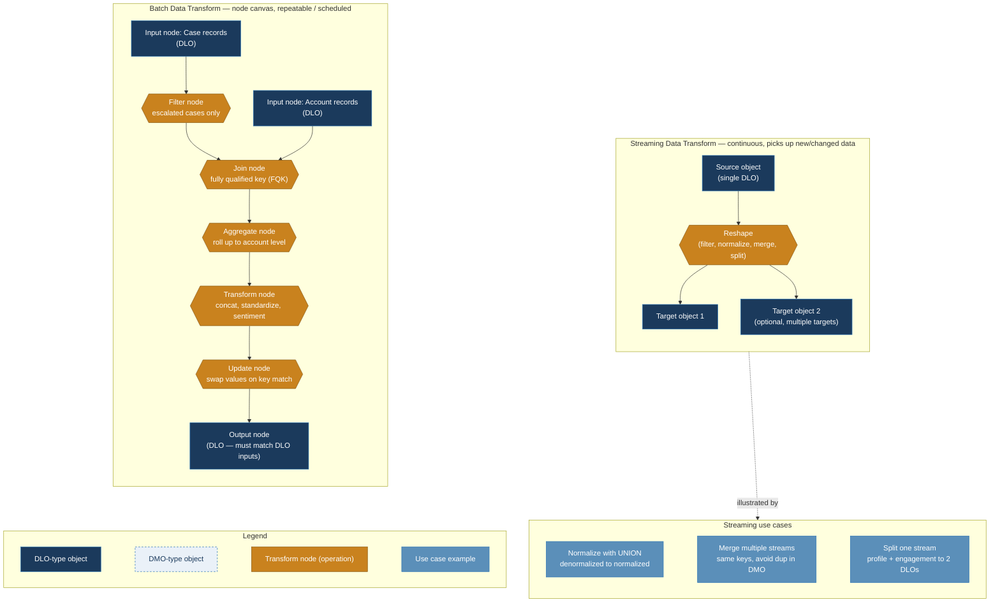

Done — added right where it belongs:

**Core objects (updated)**

| Term | Full name | Status | What it holds |
|---|---|---|---|
| **DSO** | Data Source Object | Transient | The schema definition for a connector. Data passes through it but never persists here — it lands directly in the raw DLO |
| **DLO** | Data Lake Object | Materialized | Physical storage (Parquet files, effectively) holding either raw ingested data or the output of a Data Transform |
| **UDLO** | Unstructured Data Lake Object | Materialized | References to unstructured files (PDFs, docs, transcripts) on blob storage — one row per *file*, not per record |
| **DMO** | Data Model Object | Virtual view | The canonical/custom structure unifying one or more DLOs. No storage of its own — queries push down to whichever DLO(s) feed it |
| **UDMO** | Unstructured Data Model Object | Virtual view | Same role as DMO, but for unstructured content — the structural layer over a UDLO, used as the basis for chunking and embedding |
| **CDMO** | Chunk DMO | Materialized | The actual chunked text pieces, produced by a Search Index Configuration |
| **IDMO** | Index DMO | Materialized | The vector embeddings, one per chunk — this is the literal vector store |

| Term | Status | What it holds |
|---|---|---|
| **CIO** (Calculated Insight Object) | Materialized | Computed metric values, written on the insight's own schedule |
| **Segment Membership Table** | Materialized | Which unified profiles qualify for a segment, generated at publish time |
| **Unified Individual / Unified Contact Point [Type]** | Hybrid | A DMO on the surface, but sitting on top of materialized matching/reconciliation output underneath |
| **Unified Link Individual / Unified Link Contact Point [Type]** | Materialized | The crosswalk connecting each source record's ID to its resulting unified ID |

**The operations (what labels the arrows)**

| Operation | What it actually does |
|---|---|
| **Ingest** | A Data Stream pulling source records into a raw DLO |
| **Mapping** | Field-level translation from a DLO into a DMO — no row filtering, purely structural |
| **Data Transform** | Reshapes and/or filters a DLO into a new DLO (batch or streaming) |
| **Identity Resolution** | Matches and reconciles source records, producing the Unified Link + Unified [Object] pair |
| **Search Index Config** | Chunks a DMO/UDMO's content field, producing a CDMO |
| **Embedding model** | Converts each chunk in a CDMO into a vector, producing the IDMO |
| **Scheduled SQL** | The query a Calculated Insight runs on its own cadence |
| **Segment publish / segment criteria** | The trigger that materializes a Segment Membership Table |

